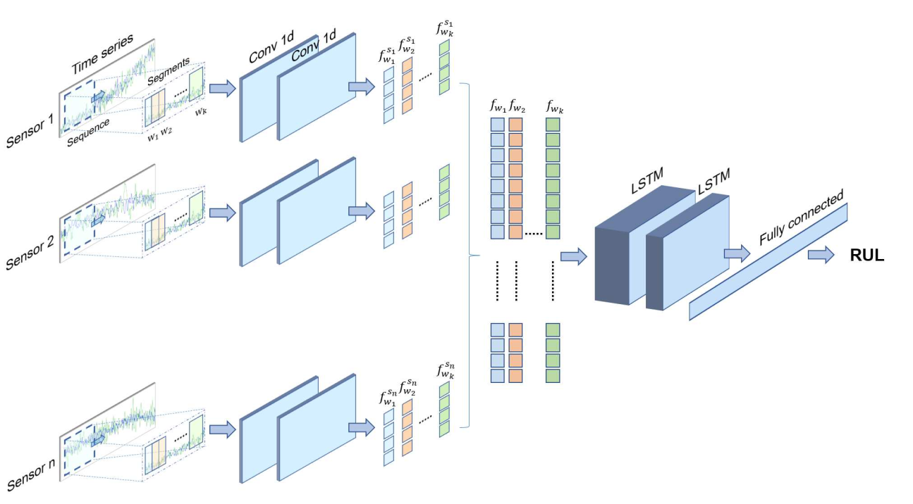

# ENAS-PdM

ENAS-PdM is a custom Evolutionary Algorithm specifically designed to optimize a Deep Network architecture used to predict the Remaining Useful Life (RUL) for predictive maintenance (PdM). Based on our previous work, [Multi-Head CNN-LSTM with Prediction Error Analysis for Remaining Useful Life Prediction](https://ieeexplore.ieee.org/abstract/document/9211058/), the goal of this study is to find the best multi-head Convolutional Neural Network with Long Short Term Memory (CNN-LSTM) architecture for the RUL prediction. For that, we use evolutionary search to explore the combinatorial parameter space of a multi-head CNN-LSTM as shown below figure. 
<p align="center">
  
</p>

## Prerequisites
You can download the benchmark dataset used in our experiments, C-MAPSS from [here](https://drive.google.com/drive/folders/1xHLtx9laqSTO_8LOFCdOBEkouMpbkAFM?usp=sharing).
The files should be placed in /tmp folder.
The ENAS-PdM library has the following dependencies:
```bash
pip install -r py_pkg_requirements.txt
```
- pandas
- numpy
- scikit-learn
- tqdm
- tensorflow-gpu
- deap
- matplotlib

## Descriptions
- launcher.py: launcher for the experiments.
  - evolutionary_algorithm.py: implementations of evolutionary algorithms to evolve neural networks in the context of predictive mainteinance.
  - task.py: implementation of a Task, used to load the data and compute the fitness of an individual.
  - utils.py: generating the multi-head CNN-LSTM network & training the network.
    - network_training.py: class for network generation and training.
    - ts_preprocessing.py: class for preprocessing and data preparation.
    - ts_window.py: class for time series window application.
- experiments.py: Evaluation of the discovered network by ENAS-PdM on unobserved data during EA & Training.

## Run
Please launch ENAS-PdM by 
```bash
python3 launcher.py
```
After each generation, the information of the best individual is displayed
```bash
50      11      11.5005 0.153568        11.2976 11.9282
pickle dump
log saved
Best individual:
[2, 4, 1, 13, 12]
Best individual is saved
37873.60605573654
```
<p align="center">
  
</p>


## References
```
H. Mo, F. Lucca, J. Malacarne and G. Iacca, 
Multi-Head CNN-LSTM with Prediction Error Analysis for Remaining Useful Life Prediction,
2020 27th Conference of Open Innovations Association (FRUCT), 
Trento, Italy, 2020, pp. 164-171, doi: 10.23919/FRUCT49677.2020.9211058.
```

```
H. Mo, L. Custode and G. Iacca, 
Evolutionary neural architecture search for remaining useful life prediction,
Applied Soft Computing, 
Volume 108, 2021, 107474,ISSN 1568-4946,
https://doi.org/10.1016/j.asoc.2021.107474.

```
